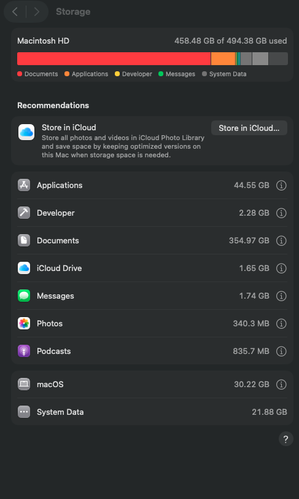
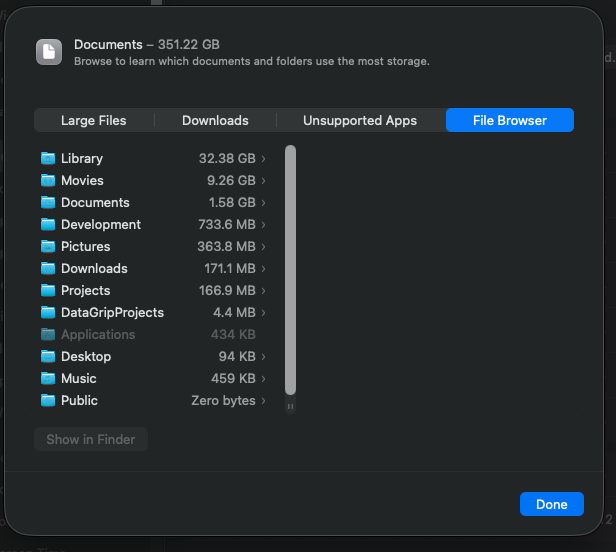

# Clean Claude Code Debug Logs

Automated cleanup solution for Claude Code debug logs that can grow to hundreds of gigabytes.

## The Problem

Claude Code stores debug logs in `~/.claude/debug/`. These files capture full session transcripts including conversation history, tool call outputs, and file contents read during sessions.

A bug in Claude Code can cause debug logs to grow exponentially during a single session - files can reach **200GB+** due to an infinite loop in the logging mechanism.





This happens when:
1. A tool call produces large output (MCP queries, file reads, etc.)
2. The debug logging captures this output
3. Under certain conditions, the log file itself gets included in subsequent logging
4. This creates a feedback loop where the log grows exponentially

Even without the bug, normal usage can accumulate significant disk space over time.

## The Solution

This repository provides two cleanup mechanisms:

### 1. Slash Command (Manual Cleanup)

Use `/cleanup-debug-logs` to manually clean up debug logs with configurable thresholds:

```bash
/cleanup-debug-logs        # Delete files >= 1GB (default)
/cleanup-debug-logs 500M   # Delete files >= 500MB
/cleanup-debug-logs all    # Delete all debug logs
```

The command shows current size, files to be deleted, and asks for confirmation before cleanup.

### 2. SessionEnd Hook (Automatic Cleanup)

A hook that runs automatically when Claude Code sessions end, cleaning up files above a configurable threshold.

## Installation

### Option 1: Copy Files Manually

1. **Slash Command** - Copy to your Claude commands directory:
   ```bash
   mkdir -p ~/.claude/commands
   cp .claude/commands/cleanup-debug-logs.md ~/.claude/commands/
   ```

2. **SessionEnd Hook** - Copy script and configure hook:
   ```bash
   mkdir -p ~/.claude/hooks
   cp hooks/cleanup-debug-logs.sh ~/.claude/hooks/
   chmod +x ~/.claude/hooks/cleanup-debug-logs.sh
   ```

3. **Configure the hook** in `~/.claude/settings.json`:
   ```json
   {
     "hooks": {
       "SessionEnd": [
         {
           "hooks": [
             {
               "type": "command",
               "command": "bash \"$HOME/.claude/hooks/cleanup-debug-logs.sh\""
             }
           ]
         }
       ]
     }
   }
   ```

### Option 2: Install via Claude Code

Ask Claude Code to install it for you:
```
Please install the cleanup-debug-logs command and hook from https://github.com/kyle-chalmers/clean-claude-code-debug-logs
```

## Configuration

### Hook Threshold

Edit `~/.claude/hooks/cleanup-debug-logs.sh` to adjust the automatic cleanup threshold:

```bash
# Set a size threshold like "500M", "1G", "100M" to only delete large files
# Or set to "all" to delete all debug logs
CLEANUP_MODE="1G"
```

### Project-Level Settings

You can also configure hooks at the project level in `.claude/settings.json` to override or supplement global settings.

## Safety

- Debug logs are safe to delete - they don't affect Claude Code functionality
- The slash command always asks for confirmation before deleting
- The hook runs silently at session end

## Files

| File | Purpose |
|------|---------|
| `.claude/commands/cleanup-debug-logs.md` | Slash command for manual cleanup |
| `hooks/cleanup-debug-logs.sh` | SessionEnd hook script |
| `video/` | Video tutorial documentation |

## Video Tutorial

See `video/README.md` for a video walkthrough explaining the problem and demonstrating the solution.

## License

MIT
