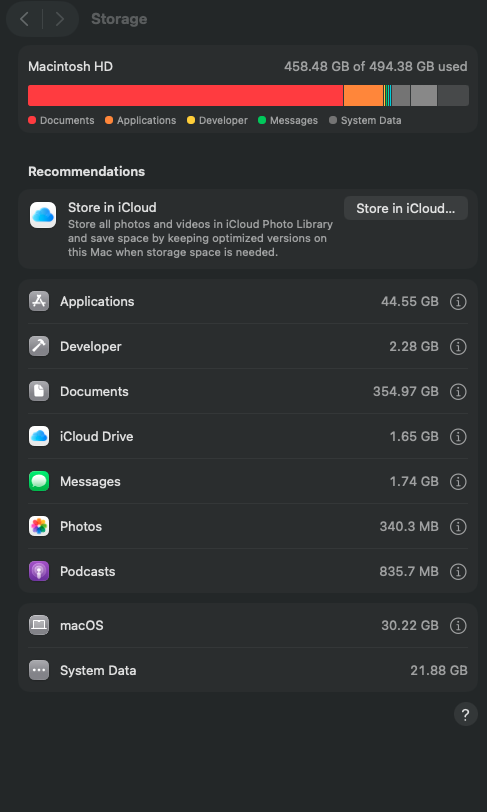
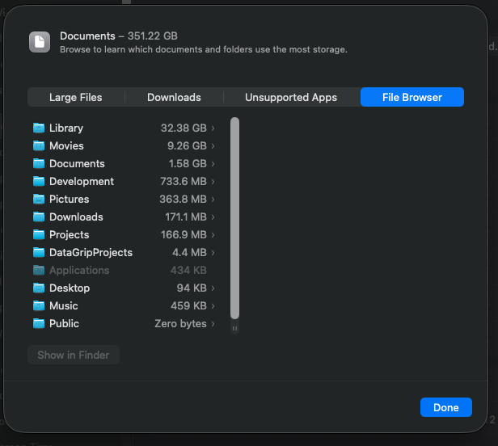

# Clean Claude Code Debug Logs

Automated cleanup solution for Claude Code debug logs that can grow to hundreds of gigabytes.

## The Problem

Claude Code stores debug logs in `~/.claude/debug/`. These files capture full session transcripts including conversation history, tool call outputs, and file contents read during sessions.

A [known bug](https://github.com/anthropics/claude-code/issues/16093) in Claude Code causes debug logs to grow exponentially during a single session — files can reach **200GB+** due to an infinite recursive logging loop.





### How the bug works

The performance monitoring system logs operations that take >75ms. When a debug log file grows large enough that writing to it becomes slow (>75ms), the logger logs the slow write — which is itself slow, triggering another log entry, creating an **infinite loop**:

```
[DEBUG] [SLOW OPERATION DETECTED] fs.appendFileSync (93.7ms)
[DEBUG] [SLOW OPERATION DETECTED] fs.appendFileSync (96.6ms)
[DEBUG] [SLOW OPERATION DETECTED] fs.appendFileSync (202.3ms)
... (millions of lines until disk is full)
```

The loop only stops when the disk fills completely, the session ends, or the process crashes.

Even without the bug, normal usage accumulates significant disk space over time.

### Check if you're affected

```bash
# Check total size
du -sh ~/.claude/debug

# Find large files (>1GB)
find ~/.claude/debug -type f -size +1G
```

## The Solution

This repository provides two cleanup mechanisms:

### 1. Slash Command (Manual Cleanup)

Use `/cleanup-debug-logs` inside any Claude Code session to manually clean up debug logs with configurable thresholds:

```bash
/cleanup-debug-logs        # Delete files >= 1GB (default)
/cleanup-debug-logs 500M   # Delete files >= 500MB
/cleanup-debug-logs all    # Delete all debug logs
```

The command shows current size, files to be deleted, and asks for confirmation before cleanup.

### 2. SessionEnd Hook (Automatic Cleanup)

A [hook](https://code.claude.com/docs/en/hooks) that runs automatically when Claude Code sessions end, cleaning up files above a configurable threshold. No manual intervention needed — set it and forget it.

## Installation

You can install the slash command, the hook, or both. Choose **global** (all projects) or **project-level** (single repo).

### Slash Command

The slash command lets you run `/cleanup-debug-logs` inside Claude Code sessions.

**Global install** (available in all projects):

```bash
mkdir -p ~/.claude/commands
cp .claude/commands/cleanup-debug-logs.md ~/.claude/commands/
```

**Project-level install** (available only in this repo):

```bash
mkdir -p .claude/commands
cp .claude/commands/cleanup-debug-logs.md .claude/commands/
```

The command file is already in this repo at `.claude/commands/cleanup-debug-logs.md`, so if you clone this repo it works immediately at the project level.

### SessionEnd Hook

The hook automatically cleans up large debug logs every time a Claude Code session ends.

**Step 1: Copy the hook script**

```bash
mkdir -p ~/.claude/hooks
cp hooks/cleanup-debug-logs.sh ~/.claude/hooks/
chmod +x ~/.claude/hooks/cleanup-debug-logs.sh
```

**Step 2: Add the hook to your settings**

**Global** — add to `~/.claude/settings.json` (applies to all projects):

```json
{
  "hooks": {
    "SessionEnd": [
      {
        "hooks": [
          {
            "type": "command",
            "command": "bash \"$HOME/.claude/hooks/cleanup-debug-logs.sh\""
          }
        ]
      }
    ]
  }
}
```

**Project-level** — add to `.claude/settings.json` in your repo root (applies only to that project):

```json
{
  "hooks": {
    "SessionEnd": [
      {
        "hooks": [
          {
            "type": "command",
            "command": "bash \"$CLAUDE_PROJECT_DIR/hooks/cleanup-debug-logs.sh\""
          }
        ]
      }
    ]
  }
}
```

> **Note:** If your `settings.json` already has other settings, merge the `hooks` key into the existing file rather than replacing it entirely. You can also use the interactive `/hooks` menu inside Claude Code to add hooks without editing JSON directly.

### Quick Install via Claude Code

Just ask Claude Code to do it for you:

```
Install the cleanup-debug-logs command and hook from https://github.com/kyle-chalmers/clean-claude-code-debug-logs
```

## Configuration

### Hook Threshold

Edit `~/.claude/hooks/cleanup-debug-logs.sh` to adjust the automatic cleanup threshold:

```bash
# Set a size threshold like "500M", "1G", "100M" to only delete large files
# Or set to "all" to delete all debug logs
CLEANUP_MODE="1G"
```

## Safety

- Debug logs are safe to delete — they don't affect Claude Code functionality
- The slash command always asks for confirmation before deleting
- The hook runs silently at session end

## Files

| File | Purpose |
|------|---------|
| `.claude/commands/cleanup-debug-logs.md` | Slash command for manual cleanup |
| `hooks/cleanup-debug-logs.sh` | SessionEnd hook script |

## Resources

- [Claude Code Hooks Documentation](https://code.claude.com/docs/en/hooks)
- [Bug Report: Infinite logging loop causes 200GB+ disk usage](https://github.com/anthropics/claude-code/issues/16093)
- [Repository](https://github.com/kyle-chalmers/clean-claude-code-debug-logs)

## License

MIT
